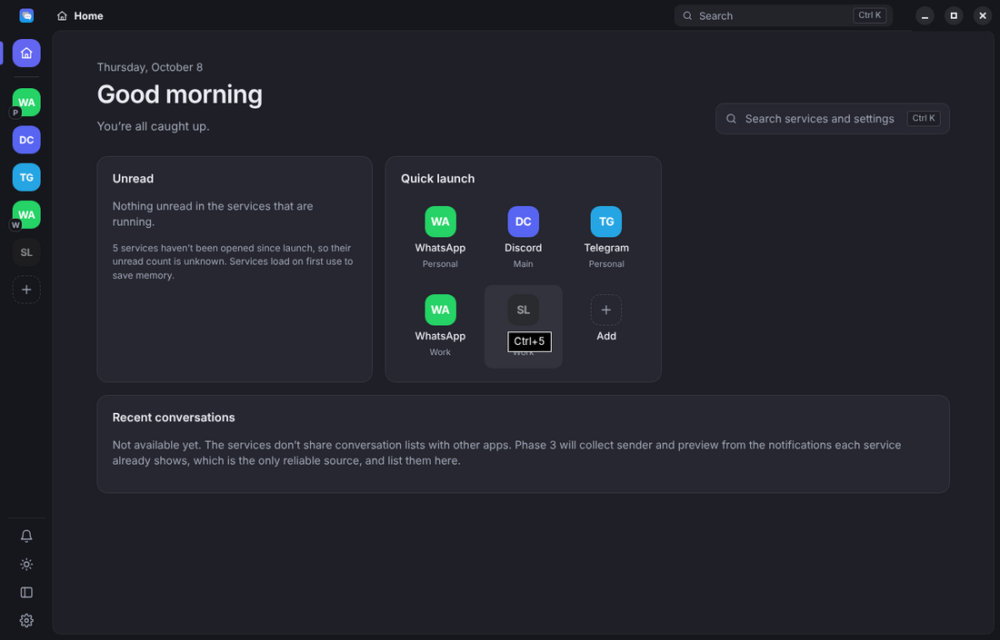
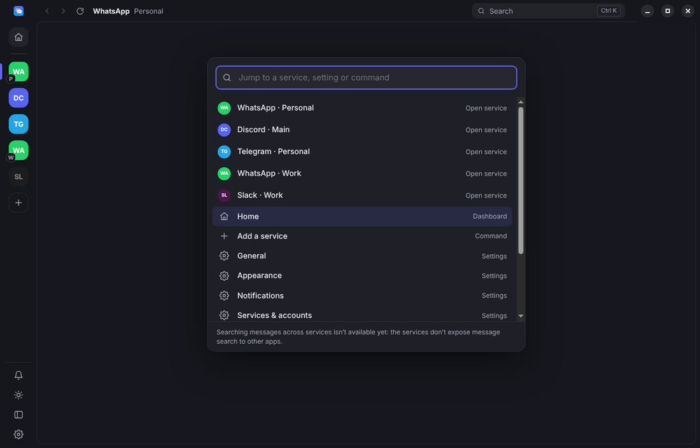
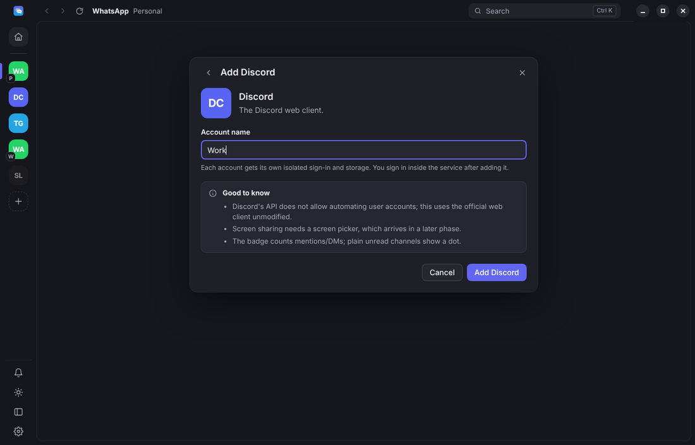
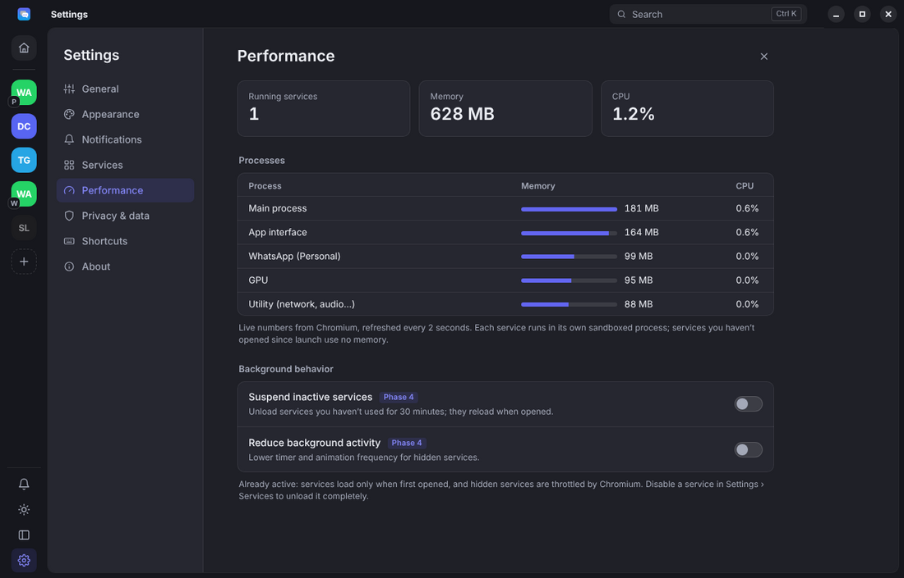
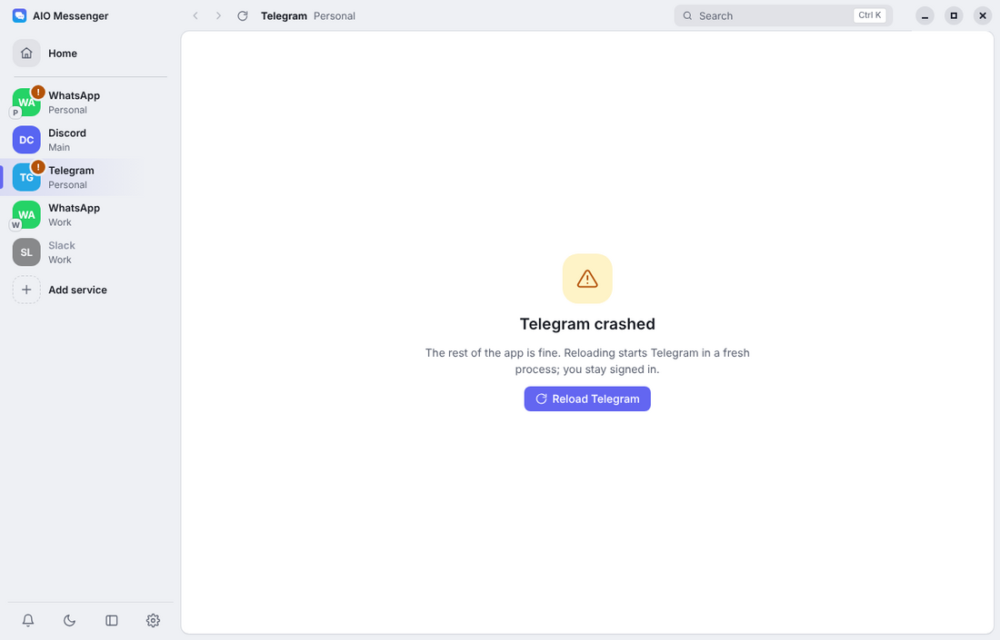

# AIO Messenger

An all‑in‑one messaging app for Windows: WhatsApp, Messenger, Instagram, Discord, Telegram, Slack, Teams, Google Chat, Gmail, Reddit and X in one window, each account in its own isolated, sandboxed session. No servers, no analytics.



Architecture, stack decision, third‑party limitations and roadmap: **[docs/ARCHITECTURE.md](docs/ARCHITECTURE.md)**.

## Status

Phase 1 (foundation) is done. See the roadmap for what's next; features from later phases are labelled in the UI rather than faked.

## Run it

Requirements: Node.js 20+ and npm. Windows 10/11 is the target; it also runs on macOS and Linux for development.

```bash
npm install
npm run dev        # development with hot reload (separate "AIO Messenger (dev)" profile)
npm run build      # production build into out/
npm start          # run the production build
npm run typecheck
```

Optional environment variables (see `.env.example`): `AIO_LOG_LEVEL`, `AIO_OPEN_DEVTOOLS=1`, `AIO_USER_DATA_DIR`.

Installers (NSIS) and automatic updates arrive in Phase 5.

## Shortcuts

| Keys | Action |
|---|---|
| Ctrl+K | Search services, settings, commands |
| Ctrl+1…9 | Go to service 1…9 |
| Ctrl+Tab / Ctrl+Shift+Tab | Next / previous service |
| Ctrl+R | Reload service |
| Alt+Left / Alt+Right | Back / forward |
| Ctrl+, | Settings |
| Ctrl+Shift+H | Home |
| Ctrl+Shift+M | Mute notifications |
| Ctrl+B | Collapse/expand sidebar |

## Where your data lives

`%APPDATA%\AIO Messenger\` – `config.json` (settings, no secrets), `sessions\<service>\<account>\` (each account's private browser profile), `logs\`. Settings › Privacy shows the exact paths and has per‑account log out, cache clearing and "clear everything".

## Screenshots

| | |
|---|---|
|  |  |
|  |  |
